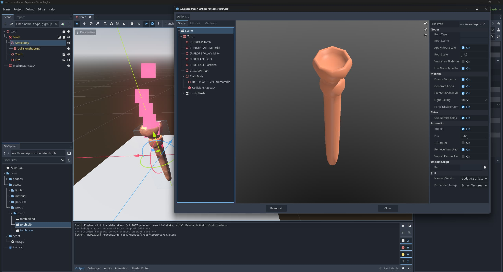

# Import Replacer

A **post-import helper** for Godot that automates cleanup and automatic assignment after importing scenes (e.g. from Blender). It uses **tagged empties** (`IR-...`) and **custom properties** to:

- replace empties with scene instances
- assign resources to properties
- set multiple properties at once
- attach scripts
- add nodes to groups
- or swap a node's type
- (Optionally) prune unneeded Node3D elements

**Result:** No manual cleanup after every export from your DCC (like Blender), re-import in Godot, done.

---

## How it works (1-minute overview)

1. In Blender (or any DCC), create **Empties** named with `IR-...`
2. Add **Custom Properties** based on the documentation
3. Export to glTF with **Custom Properties** enabled
4. On import, the plugin reads these instructions, applies them and removes the helper empties
5. (Optionally) prunes any Node3D elements

---

## Installation

1. Copy the addon to: `addons/import_replacer/`
2. In Godot: **Project > Project Settings > Plugins** > enable **Import Replacer**
3. Right-click your `.glb/.gltf` > **Reimport**

> The plugin logs to the editor output with the tag `[IMPORT REPLACER]`.

---

## Sample Project

Open `sample/` as a Godot project and re-import `torch.glb`.
It demonstrates all features in this scene.

> The Blender source file is included at `assets/props/torch`.

---

## Authoring empties

Any node whose **name starts with `IR-`** will be processed. Supported names:

| Tag               | Purpose                                                    |
| :---------------- | :--------------------------------------------------------- |
| `IR-REPLACE`      | Replace an empty with a scene                              |
| `IR-PROP_PATH`    | Set a property with an existing resource (like a Material) |
| `IR-PROPS_VAL`    | Set multiple values in the properties                      |
| `IR-SCRIPT`       | Attach a script                                            |
| `IR-GROUP`        | Add to a group                                             |
| `IR-REPLACE_TYPE` | Change the type of the node                                |
| `IR-NO_IMPORT`    | Delete the parent node. Equivalent to `-noimp`             |

## Methods

### `IR-REPLACE`

**Goal:** Replace the empty with an instance of a scene.  
**Reads:** `ir_path` (appends `.tscn`)  
**Placement:** Put the empty where you want the new instance; its transform is copied.  
**Effect:** Instantiates under the same parent, copies empty `transform`, sets owner, deletes empty.

**Example:**

- Name: `IR-REPLACE`
- `ir_path = "assets/lights/torch"`

---

### `IR-PROP_PATH`

**Goal:** Set a property on the **parent node** to a existing **Resource**.  
**Reads:** `ir_res` (appends `.tres`), `ir_prop`  
**Placement:** empty as **child** of the node whose property you want to set.

**Example:**

- Name: `IR-PROP_PATH`
- `ir_prop = "surface_material_override/0"`
- `ir_res  = "assets/material/wood"`

---

### `IR-PROPS_VAL`

**Goal:** Set **multiple properties** (raw values) on the **parent node**.  
**Reads:** `ir_prop/N`, `ir_val/N` pairs  
**Placement:** empty as **child** of the node you want to modify.

**Example:**

- Name: `IR-PROPS_VAL`
- `ir_prop/0 = "visibility_range_end"` > `ir_val/0 = "5"`
- `ir_prop/1 = "visibility_range_end_margin"` > `ir_val/1 = "1"`
- `ir_prop/2 = "visibility_range_fade_mode"` > `ir_val/2 = "1"`

---

### `IR-SCRIPT`

**Goal:** Attach a script to the **parent node**.  
**Reads:** `ir_path` (appends `.gd`)  
**Placement:** empty as **child** of the node that should receive the script.

**Example:**

- Name: `IR-SCRIPT`
- `ir_path = "script/test"`

---

### `IR-GROUP`

**Goal:** Add the **parent node** to a group.  
**Reads:** `ir_val` (group name)  
**Placement:** empty as **child** of the node you want to add to the group.

**Example:**

- Name: `IR-GROUP`
- `ir_val = "torch"`

---

### `IR-REPLACE_TYPE`

**Goal:** Replace a node with a **different engine/custom type**.  
**Reads:** `ir_val` (class name)  
**Placement:** **Put this empty as a direct child of the node you want to replace.**  
**Effect:** Replaces the **parent** with `ir_val`, preserves name/transform, keeps children.

**Examples:**

- Name: `IR-REPLACE_TYPE`
- `ir_val = "AnimatableBody3D"`

---

### `IR-NO_IMPORT`

**Goal:** Do not import the parent node.  
**Reads:** none  
**Placement:** **Put this empty as a direct child of the node you don't want to import.**  
**Effect:** Does not import the parent node. Similar to `-noimp`

**Examples:**

- Name: `IR-NO_IMPORT`

---

## Path Conventions

- Don't include file extensions in `ir_path` / `ir_res`
  - `.tscn` for scenes
  - `.tres` for resources
  - `.gd` for scripts
- Use project-relative paths: `folder/name_without_extension`.

---

## Node Pruning

Some software like Blender using the AssetBrowser with collections, uses empties which are only required for handling inside. On import in Godot you can enable to prune those empty Node3D elements. This can help to reduce complexity in the sceen tree or when having issues with origin points offset to an object.

- In _Project Settings_ you can enable or disable this feature `addons/import_replacer/always_prune_wrapper`
- Also in the _Project Settings_ you can configure which elements should not be pruned with a `;` seperated list in `addons/import_replacer/prune_wrapper_ignore`

---

## Troubleshooting

- **"No Custom Properties in node … found"**  
  Enable **Custom Properties** in the exporter and put them on the **Empty's Object**. Make sure to only add the Custom Properties on _Object_, as others will be ignored
- **"Requested type/class... does not exist!"**  
  `ir_val` must be a valid Godot class or a `class_name`
- **Nothing happens**  
  Check plugin enabled, names start with `IR-`, paths are correct (without extensions), then re-import
- **Resource didn't assign**  
  Property must accept a Resource and the `.tres` must exist

---

## Notes

- All `IR-...` empties are deleted after import
- `PROP_PATH`, `PROPS_VAL`, `SCRIPT`, `GROUP` modify the **parent**
- `REPLACE` spawns a sibling instance, copies the empty's transform
- `REPLACE_TYPE` replaces the parent, preserves children
- Ownership is set to the imported scene root for editability
